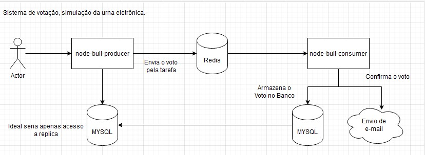
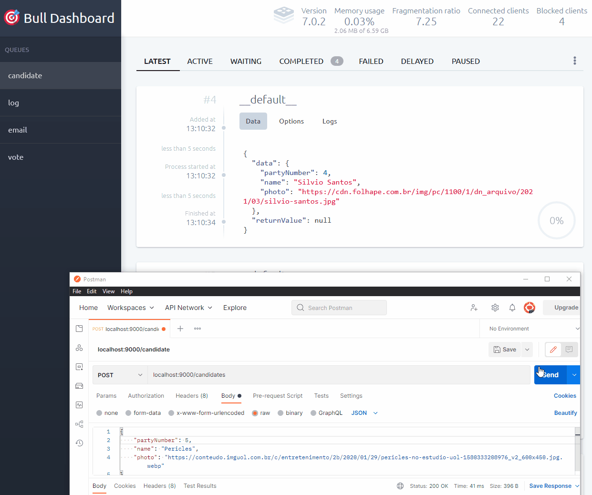
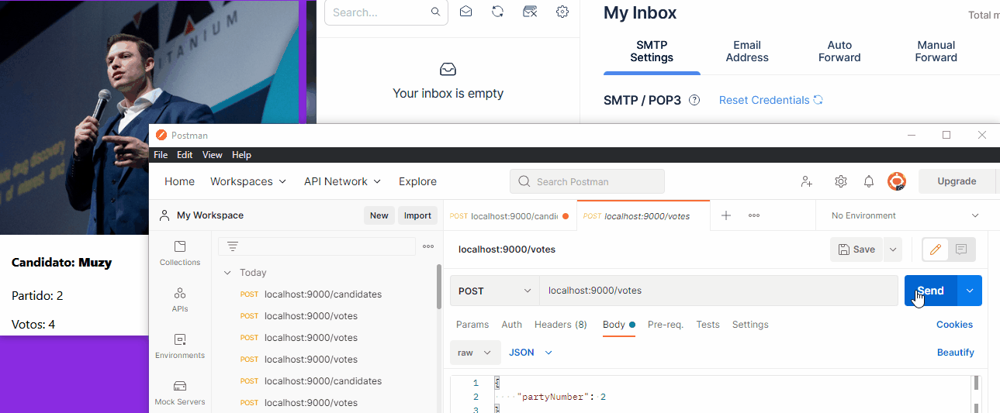
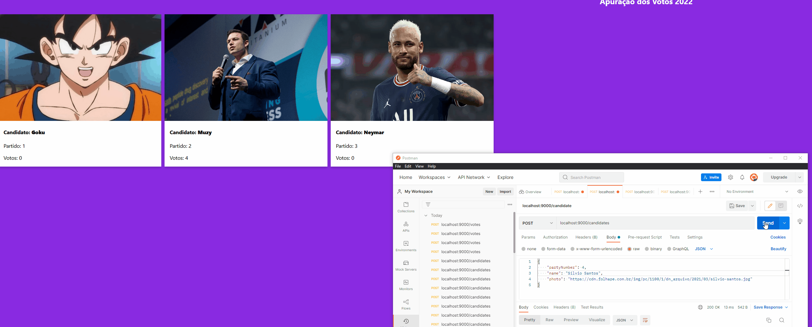
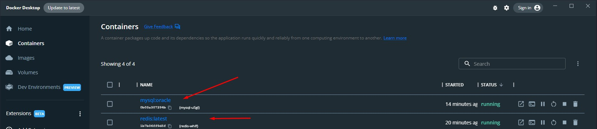
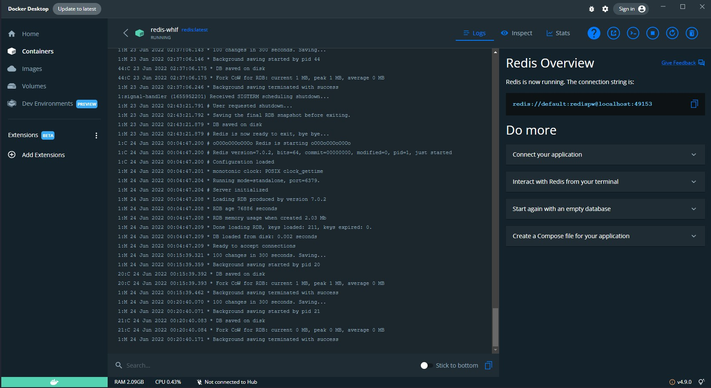
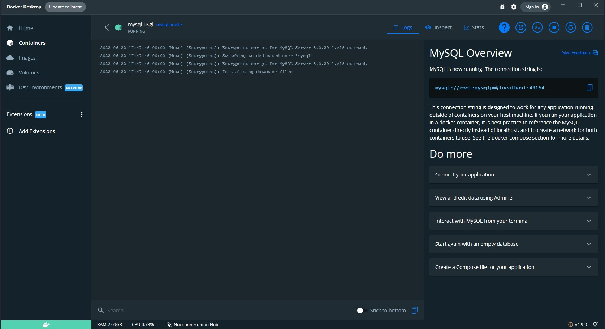
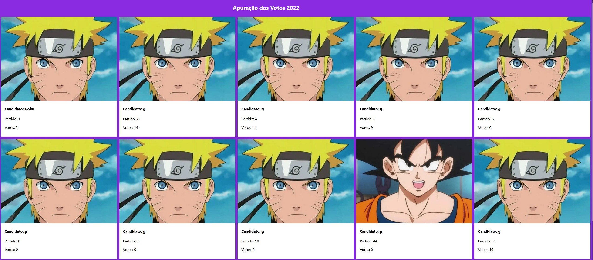
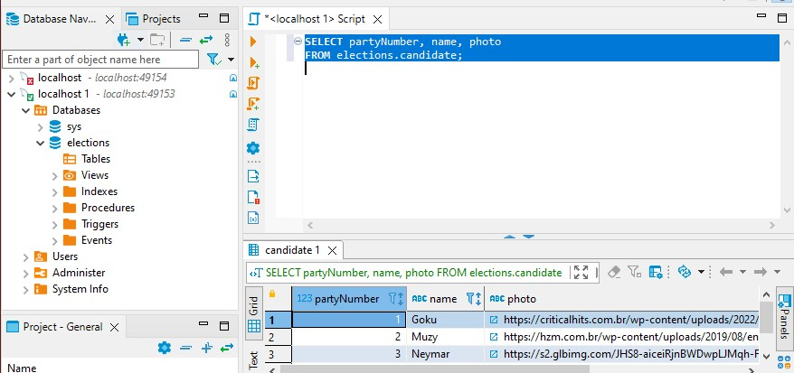
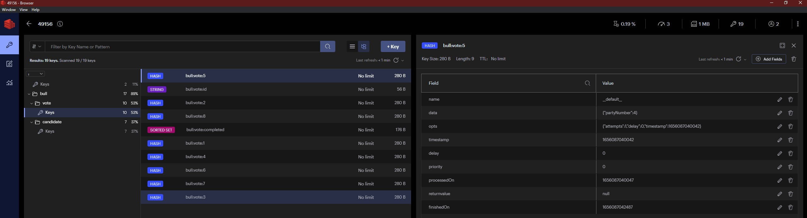

# Aula 1

## Ementa
 - Apresentação
 - Requisitos
 - Desafio

---
## Apresentação

O que são serviços de mensageria?

# Requisitos
- NodeJS <https://nodejs.org/en/download/>
- Redis <https://www.docker.com/products/docker-desktop/> ou <https://medium.com/dockerbr/instalando-o-redis-em-um-container-docker-no-windows-a49b42988428>
- MySQL <https://www.docker.com/products/docker-desktop/> ou <https://dev.mysql.com/downloads/installer/>
- Postman <https://www.postman.com/downloads/>
- Redis Insight <https://redis.com/redis-enterprise/redis-insight/>
- Mailtrap <https://mailtrap.io/inboxes>
- Dbeaver <https://dbeaver.io/download/>

# Desafio

<center>

<h2>Eleições 2022 Fake</h2>

<p>Simulação do processo eleitoral</p>

</center>

## Diagrama

Desenahando a aplicação


> https://app.diagrams.net/#G1WdhUMQIOzgTOYi27Qi4iM0g0yaj59XCA

- Envio das votações por tarefas
  - Utilizaremos a biblioteca node-bull com o provider Redis para enviar o voto
- Envio de e-mail confirmando o voto
- Notificação via Web Socket para atualizar os votos em tempo real aos clientes web.

## Bull Dashboard


## Mail Trap


## Web Socket


## Docker Desktop
> Containers Rodando



> Container Redis com a connection sstring



> Container MYSQL com a connection sstring



> Página web simples <http://localhost:9001>



## Dbeaver
> Devemos criar o database 'elections'



```
Para usuários do DBeaver:
Clique com o botão direito na sua conexão, escolha "Editar Conexão"
Na tela "Configurações de conexão" (tela principal), clique em "Editar configurações do driver"
Clique em "Propriedades da conexão"
Clique com o botão direito na área "propriedades do usuário" e escolha "Adicionar nova propriedade"
Adicione duas propriedades: "useSSL" e "allowPublicKeyRetrieval"
Defina seus valores como "false" e "true" clicando duas vezes na coluna "value"
```

> Redis Insight




## Links Úteis

- <https://app.diagrams.net/#G1WdhUMQIOzgTOYi27Qi4iM0g0yaj59XCA>
- <https://mailtrap.io/>
- <https://higher-order-programmer.medium.com/node-js-utilizando-filas-de-tarefas-ass%C3%ADncronas-com-bull-redis-71540f4be6ec>
- <https://www.blogdoft.com.br/2021/02/06/o-que-sao-mensageria-eventos-filas-e-topicos/>
- <https://www.youtube.com/watch?v=U5h6B7eSiAE>
- <https://www.youtube.com/watch?v=CYWEjcppJg0>
- <https://www.dinamize.com.br/blog/por-que-voce-deveria-utilizar-mensageria-na-aplicacao/>