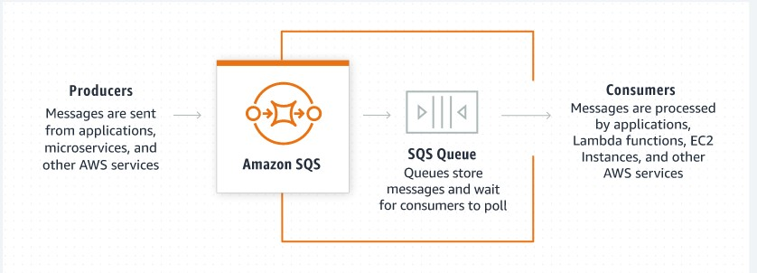
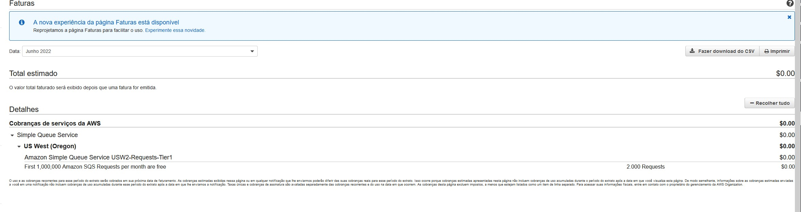

# Amazon SQS

Amazon Simple Queue Service é um serviço de enfileiramento de mensagens rápido, confiável, escalável,
totalmente gerenciado que permite integrar e desacoplar sistemas de software e componentes distribuídos.
Ele oferece constructos comuns, como filas de mensagens mortas e tags de alocação de custos.
Ele fornece uma API de serviço da Web genérica e pode ser acessado por qualquer linguagem de programação compatível com o AWS SDK.

## Onde usar ?
Você pode usar o Amazon SQS para transmitir qualquer volume de dados, em qualquer nível de transferência.
Sem perder mensagens ou exigir que outros serviços estejam continuamente disponíveis.
Com o Amazon SQS, você pode descarregar a carga administrativa de operar e escalar um cluster de mensagens altamente disponível, pagando apenas um preço baixo pelo que você usa.
Deste modo permitindo que você mova dados entre componentes distribuídos para executar diferentes tarefas conforme necessário.

## O que é a fila SQS ?
Uma fila do Amazon SQS é basicamente um buffer entre os componentes do aplicativo que recebem dados e os componentes que processam os dados em seu sistema.
Se os seus servidores de processamento não puderem processar o trabalho com rapidez suficiente (talvez devido a um aumento no tráfego), o trabalho é enfileirado.
Assim para que os servidores de processamento possam chegar a ele quando estiverem prontos.
Isso significa que o trabalho não é perdido devido a recursos insuficientes.

## Garantia de Entrega
O Amazon SQS garante a entrega de cada mensagem pelo menos uma vez e oferece suporte a vários leitores e escritores que interagem com a mesma fila.
Uma única fila pode ser usada simultaneamente por muitos componentes de aplicativos distribuídos, sem necessidade de esses componentes se coordenarem entre si para compartilhar a fila.
Embora a maior parte do tempo cada mensagem seja entregue ao seu aplicativo exatamente uma vez.
Você deve projetar seu sistema para ser idempotente (ou seja, não deve ser afetado negativamente se processa a mesma mensagem mais de uma vez).

## Disponibilidade

O Amazon SQS é projetado para estar altamente disponível.
Deste modo entregar mensagens de maneira confiável e eficiente; no entanto, o serviço não garante a entrega de mensagens First In, First Out (FIFO).
Para muitas aplicações distribuídas, cada mensagem pode ficar sozinha e, se todas as mensagens forem entregues, a ordem não é importante.

## Preservar a ordem de mensagens

Você pode colocar as informações de seqüência em cada mensagem para que possa reordenar as mensagens quando elas são recuperadas da fila.

> Exemplo de aplicação no mundo real

> Estutura de exemplo de filas SQS com producers e consumers 

> Quando ocorre uma falha no subscriber você poderá enviar para uma Dead Letter Queue 

> Na AWS você pode acompanhar os gastos da aplicação

> Você pode definir alertas de custos de recursos da AWS 

> Não esqueça de definir autenticação de duplo fator.

## Diferença entre SNS e SQS

o SNS serve para notificar vários consumidores ao mesmo tempo, podendo ser um dos consumidores um SQS por exemplo, pois o SNS faz um esquema de push, já o SQS para conseguirmos acessar fazemos pull.

<https://www.youtube.com/watch?v=mXk0MNjlO7A>
